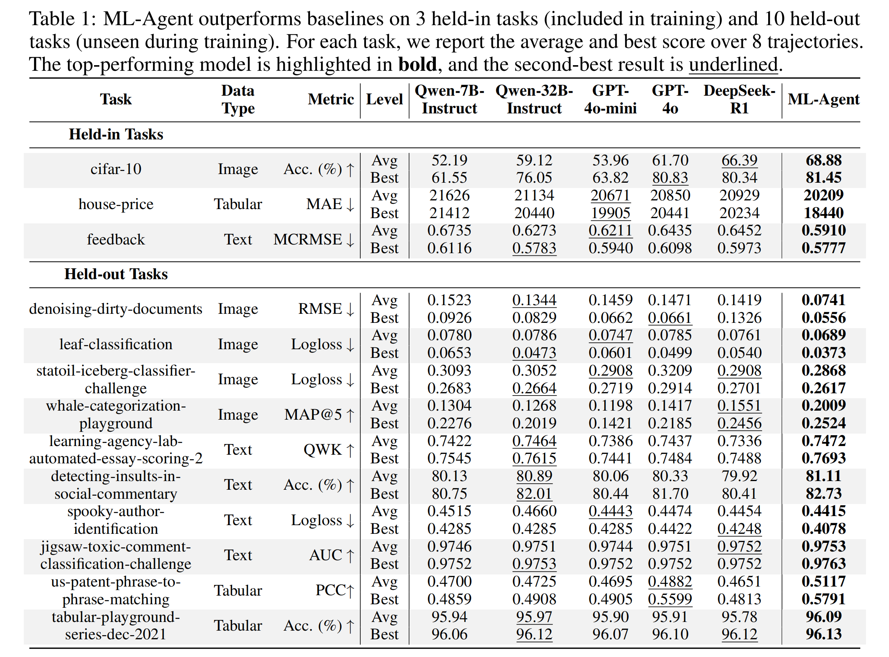

# ML-Agent: Reinforcing LLM Agents for Autonomous Machine Learning Engineering
This repository is the official implementation of [ML-Agent: Reinforcing LLM Agents for Autonomous Machine Learning Engineering](https://arxiv.org/pdf/2505.23723).

<div align="center">
  
</div>

## Machine Learning Tasks
In our paper, we organize 9 training tasks (held-in) for both exploration-enriched fine-tuning and step-wise reinforcement learning(RL) and 10 tasks (held-out) for further evaluation. All tasks all collected from [MLAgentBench](https://arxiv.org/abs/2310.03302) (MLA) and [MLEBench](https://arxiv.org/abs/2410.07095) (MLE). 

The tasks are listed as follows:
| Task Name                                           | Data Type | Task Type    | Metric   | Source |
|-----------------------------------------------------|-----------|--------------|----------|--------|
| **Training**                                         |           |              |          |        |
| cifar-10                                            | Image     | Classification | Acc. (%) ↑ | MLA    |
| aerial-cactus-identification                        | Image     | Classification | AUC ↑    | MLE    |
| dogs-vs-cats-redux-kernels-edition                  | Image     | Classification | Logloss ↓ | MLE    |
| plant-pathology-2020-fgvc7                          | Image     | Classification | AUC ↑    | MLE    |
| home-data-for-ml-course                             | Tabular   | Regression    | MAE ↓    | MLA    |
| spaceship-titanic                                   | Tabular   | Regression    | Acc. (%) ↑ | MLA    |
| nomad2018-predict-transparent-conductors            | Tabular   | Regression    | RMSLE ↓  | MLE    |
| feedback-prize-english-language-learning            | Text      | Classification | MCRMSE ↓ | MLA    |
| ogbn-arxiv                                          | Graph     | Classification | Acc. (%) ↑ | MLA    |
| **Testing**                                          |           |              |          |        |
| denoising-dirty-documents                           | Image     | Generation    | RMSE ↓    | MLE    |
| leaf-classification                                 | Image     | Classification | Logloss ↓ | MLE    |
| statoil-iceberg-classifier-challenge                | Image     | Classification | Logloss ↓ | MLE    |
| whale-categorization-playground                     | Image     | Classification | MAP@5 ↑   | MLE    |
| learning-agency-lab-automated-essay-scoring-2        | Text      | Regression    | QWK ↑     | MLE    |
| detecting-insults-in-social-commentary              | Text      | Classification | Acc. (%) ↑ | MLE    |
| spooky-author-identification                         | Text      | Classification | Logloss ↓ | MLE    |
| jigsaw-toxic-comment-classification-challenge       | Text      | Classification | AUC ↑     | MLE    |
| us-patent-phrase-to-phrase-matching                 | Tabular   | Regression    | PCC ↑     | MLE    |
| tabular-playground-series-dec-2021                  | Tabular   | Regression    | Acc. (%) ↑ | MLE    |


## Results
**ML-Agent** achieves state-of-the-art performance through a agentic training framework combining:  1. Exploration-Enriched Fine-Tuning, 2. Step-wise Reinforcement Learning, and 3. Unified Reward Mechanism.  

<div align="center">
  
  <br>
  
</div>

**Key outcomes**:
- 🚀 **ML-Agent achieves superior performance across both held-in and held-out tasks.**: Trained on **9 tasks** with **7B Qwen-2.5 model**, outperforms other 5 baselines, e.g. **671B DeepSeek-R1**. (Table 1)
- 🔥 **ML-Agent outperforms stat-of-the-art agents.**: Comparing with AIDE-based agents (AIDE-4o, AIDE-o1, AIDE-r1), ML-Agent achieves best performance on most 11 tasks. (Figure 3)
- ⚡ **ML-Agent achieves continuous performance improvements.**: As training progresses, performance of ML-Agent increases. (Figure 4)


## Requirements
- **Training.** For exploration-enriched fine-tuning, we use [LLaMA-Factory](https://github.com/hiyouga/LLaMA-Factory) codebase; for step-wise RL, we use [VeRL](https://github.com/volcengine/verl) codebase. Please follow the instructions in the respective repositories to set up the environment for training.

- **Evaluation.** For environment to evaluate the agents on different machine learning tasks, please follow the instructions below: ```
pip install -r eval_requirements.txt```. Despite this, machine learning tasks are executed in another environment. You can use the following command to create a new conda environment mlagentbench:
    ```
    conda create -n mlagentbench python=3.10
    conda activate mlagentbench
    pip install -r mlagent_requirements.txt
    ```


## Training
### Exploration-enriched Fine-tuning
The base model for fine-tuning is Qwen2.5-7B, you can dowonload here [Qwen/Qwen2.5-7B](https://huggingface.co/Qwen/Qwen2.5-7B).
```
bash scripts/train_step1.sh
```
### Step-wise Reinforcement Learning
RL is trained on the fine-tuned model from step 1.
```
bash scripts/train_step2.sh
```

## Evaluation
We evaluate on 3 held-in tasks (cifar-10, house-price, feedback) and 10 held-out tasks.
```
bash scripts/eval.sh
```
You can specific the evaluation task and the model checkpoint by setting the following parameters in the script ```scripts/eval.sh```.


## 🌐 Public Release Schedule

We are gradually releasing components of ML-Agent to ensure reproducibility and accessibility for the research community.

### ✅ Available Now
- [x] Exploration-Enriched Fine-Tuning code

### 🔄 To Be Released
- [ ] Model checkpoints
- [ ] Evaluation code
- [ ] Step-wise Reinforcement Learning code
- [ ] Training datasets


## Citation
If you find the project helpful, please cite:
```
@article{liu2025mlagentreinforcingllmagents,
      title={ML-Agent: Reinforcing LLM Agents for Autonomous Machine Learning Engineering}, 
      author={Zexi Liu and Jingyi Chai and Xinyu Zhu and Shuo Tang and Rui Ye and Bo Zhang and Lei Bai and Siheng Chen},
      year={2025},
      journal = {arXiv preprint arXiv: 2505.23723}
}
```
